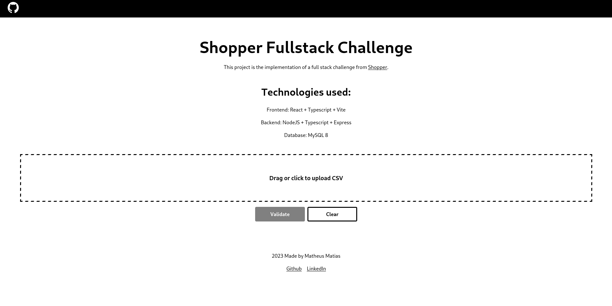
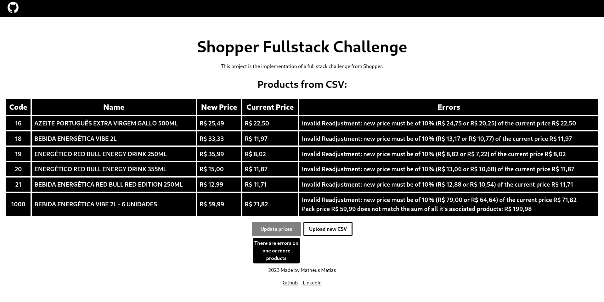

# Shopper Fullstack Challenge

## About:

This project is the implementation of the Full Stack Challenge, from [Shopper](https://landing.shopper.com.br/).

## Technologies used:

### Webapp:

- [React](https://react.dev/) ^18.2.0
- [Typescript](https://www.typescriptlang.org/) ^5.0.2
- [Vite](https://vitejs.dev/) ^4.4.5
- [CSS Modules](https://github.com/css-modules/css-modules)

### Webservice:

- [NodeJS](https://nodejs.org/) ^18.17.1
- [Typescript](https://www.typescriptlang.org/) ^5.1.6
- [Express](https://expressjs.com/) ^4.18.2

### Database:

- [MySQL](https://www.mysql.com/) 8.0

## Features:

1. This web application offers users the ability to upload a CSV file containing product information, including product codes and new prices.
   
2. Users can validate and update the CSV data if it adheres to specified validation rules and doesn't violate any policy regulations.
3. After the validation, the application displays a table listing each product that has undergone validation along with any policy rules that may have been violated.
   

- To test the application, you can utilize CSV files located in the backend/test_files directory.

Web Service:

- The web service's validation process can be accessed at /api/validate and involves several key steps:

  1. Verify the presence of all required CSV fields;
  2. Confirm the existence of product codes from the CSV in the database;
  3. Validate that the prices are numerical and within acceptable ranges (can only change within +/- 10% and must be higher than the product's cost price in the database);
  4. Check for the presence of product packs in the CSV. If found, ensure that all associated products are also included in the CSV and calculate whether the sum of their new prices matches the pack's new price.

- The web service's database update process can be accessed at /api/update and encompasses the following actions:
  1. Update prices for products in the CSV that are not associated with any packs, provided they meet all validation criteria;
  2. If a product in the CSV is associated with a pack, automatically adjust the pack's price to match the new price of its associated products.

## Run the project:

DISCLAIMER: ALL of the terminal commands contained in this README.md assumes that you are in the ROOT directory of the project.

- First, setup the environment variables. To do it, run the following command in your terminal:

  ```bash
  cp .env.example ./.env
  ```

  Then, you can change the .env variables if you want it. But it is not needed to run the project.

- There are two ways to run this project:
  1. With [Docker](https://www.docker.com/) (RECOMMENDED)
  2. Without [Docker](https://www.docker.com/)

### With Docker:

To run the project with docker, you'll need to have it [installed](https://docs.docker.com/get-docker/).

- Prerequisites:

  - Bash compatible terminal
  - xargs
  - source
  - export
  - grep

  These programs are builtin in most unix like Operating Systems.

- To start the project, run the following command in your terminal:
  ```bash
  docker compose up -d
  ```
  - If you need to see the webapp logs, run:
    ```bash
    docker logs -f webapp
    ```
  - If you need to see the webservice logs, run:
    ```bash
    docker logs -f webservice
    ```
  - If you need to see the database logs, run:
    ```bash
    docker logs -f database
    ```
  - If you need to interact with the database, run:
    ```bash
    docker exec -it database /bin/sh
    source ./.env && export $(grep DB_DEV_PASSWORD /.env | xargs)
    source ./.env && export $(grep DB_DEV_USER /.env | xargs)
    source ./.env && export $(grep DB_NAME /.env | xargs)
    mysql -u $DB_DEV_USER --password=$DB_DEV_PASSWORD -D $DB_NAME
    ```
  - If you want to clear the database, run the following commands:
    ```bash
    docker exec -it database /bin/sh
    source ./.env && export $(grep DB_DEV_PASSWORD /.env | xargs)
    source ./.env && export $(grep DB_DEV_USER /.env | xargs)
    source ./.env && export $(grep DB_NAME /.env | xargs)
    mysql -u $DB_DEV_USER --password=$DB_DEV_PASSWORD -D $DB_NAME </database_scripts/clear-database.sql
    exit
    ```
  - If you want to repopulate the database, run the following commands:
    ```bash
    docker exec -it database /bin/sh
    source ./.env && export $(grep DB_DEV_PASSWORD /.env | xargs)
    source ./.env && export $(grep DB_DEV_USER /.env | xargs)
    source ./.env && export $(grep DB_NAME /.env | xargs)
    mysql -u $DB_DEV_USER --password=$DB_DEV_PASSWORD -D $DB_NAME <./database_scripts/populate-database.sql
    exit
    ```
  - To stop the project, run:
    ```bash
    docker compose down
    ```

### Without Docker:

- To run without docker, you'll need to have [MySQL](https://www.mysql.com/) version 8 installed and running in your local port 3306 (or your custom database port, if you changed the DB_LOCAL_PORT .env variable)
- You will also need [NodeJS](https://nodejs.org/) v^18.17.1
- Create a database with the same name as the .env variable DB_NAME in your local MySQL database.
- Run the backend/database_scripts/populate-database.sql in your local MySQL database.
- Install the webservice dependencies and run it:
  Run the following command in your terminal:
  ```bash
  cd backend
  npm install && npm run dev
  ```
- Install the webapp dependencies and run it:
  ```bash
  cd frontend
  npm install && npm run dev
  ```

## Accessing the services:

### Webapp

The webapp will be accessible at http://localhost:4000 by default. If you have customized the port in your .env file using the VITE_LOCAL_PORT variable, it will be available at your specified port instead. Please note that when starting the application with Docker Compose, the database may take up to two minutes to initialize. Therefore, it is advisable to wait for this initialization period to complete before launching the web application. This waiting period is only required during the initial startup.

### Webservice

The webservice will be available in http://localhost:3000, or in your custom port, in case you changed the .env PORT variable

- The endpoints are:
  - /api/validate: validates the csv file and return the list of products that are being targeted to have their prices updated.
  - /api/update/:product_code: update the the product with \[product_code\] with the json: { new_price: [\new_price\] }
